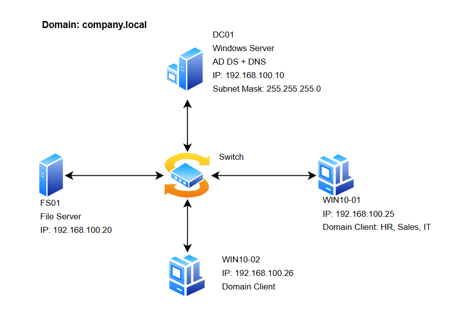
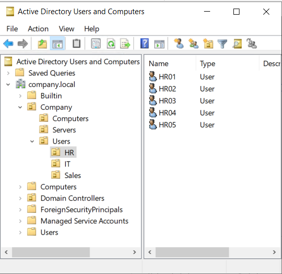
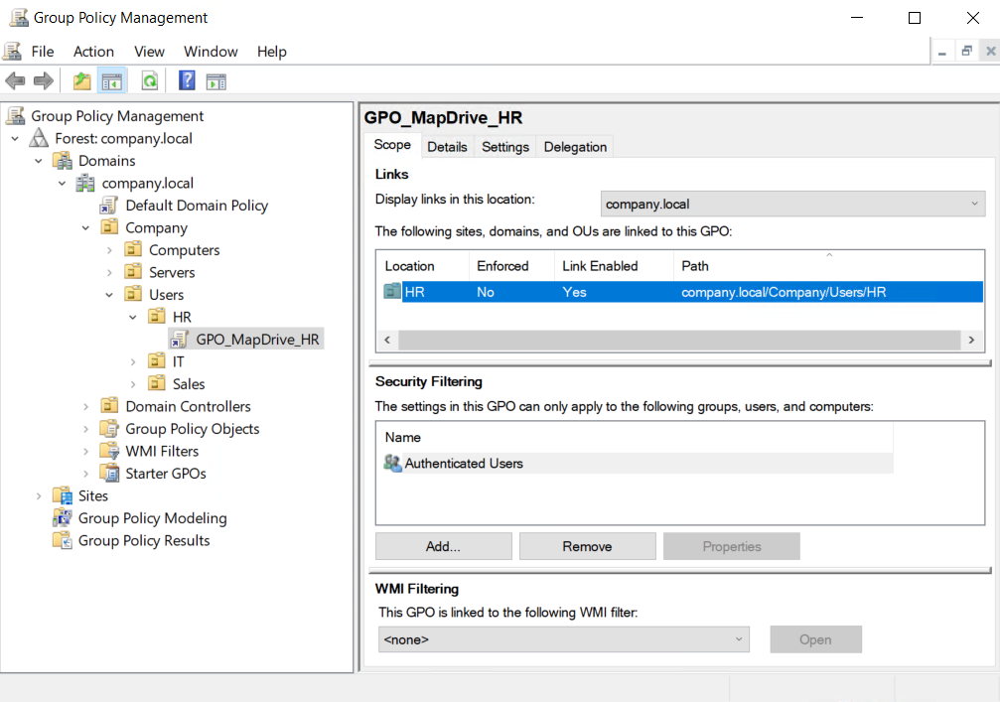
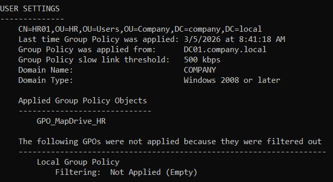
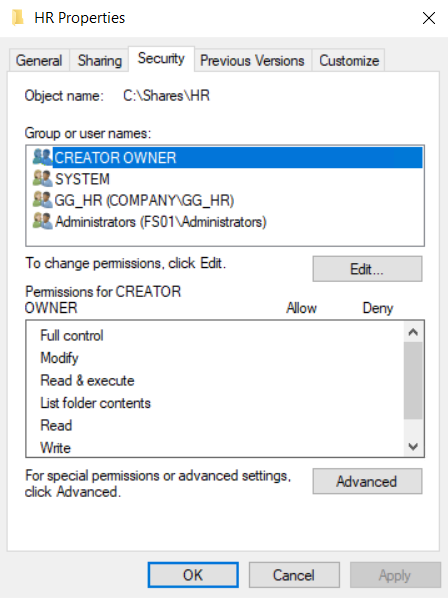

# Windows Enterprise Infrastructure Lab

## Overview

This project simulates a small company IT infrastructure (30–50 employees) using Windows Server technologies.
The lab demonstrates how Active Directory, Group Policy, and File Server permissions are used to manage users and resources in a corporate environment.

Technologies used:

* Windows Server 2022
* Active Directory Domain Services (AD DS)
* DNS
* Group Policy (GPO)
* File Server & NTFS Permissions
* PowerShell
* Windows 10 Domain Clients

---

## Architecture

Domain: **company.local**

Infrastructure components:

| Server   | Role                   | IP             |
| -------- | ---------------------- | -------------- |
| DC01     | Domain Controller, DNS | 192.168.100.10 |
| FS01     | File Server            | 192.168.100.20 |
| WIN10-01 | Domain Client          | 192.168.100.25 |
| WIN10-02 | Domain Client          | 192.168.100.26 |

Architecture diagram:



---

## Active Directory Structure

The domain is organized using Organizational Units (OU) to separate users, computers, and servers.

```
Company
 ├── Users
 │   ├── HR
 │   ├── Sales
 │   └── IT
 ├── Computers
 └── Servers
```

### Active Directory OU Structure



Purpose of this design:

* Separate departments for easier user management
* Allow targeted Group Policy application
* Keep servers and client machines organized
* Reflect a realistic company Active Directory structure

---

## Security Groups

Access control is managed using **security groups instead of assigning permissions directly to users**.

Groups created:

* HR_Group
* Sales_Group
* IT_Group

Users are added to their respective department groups.

---

## Group Policy Configuration

The following Group Policies were implemented to manage users and enforce security settings.

### Password Policy

Enforces strong passwords for all domain users.

### Account Lockout Policy

Locks user accounts after multiple failed login attempts.

### Desktop Restrictions

Standardizes the desktop environment and limits unnecessary user customization.

### Network Drive Mapping

Automatically maps department drives when users log in.

Example:

* HR users → `H:` drive → `\\FS01\HR`
* Sales users → `S:` drive → `\\FS01\Sales`

### Network Drive Mapping GPO



### GPO Applied on Client



---

## File Server Configuration

File shares are hosted on **FS01**.

Shared folders:

```
\\FS01\HR
\\FS01\Sales
```

Permissions are configured using:

* **NTFS permissions**
* **Share permissions**
* **Security groups**

### NTFS Permissions Example



Example permission model:

| Folder | Access           |
| ------ | ---------------- |
| HR     | HR_Group only    |
| Sales  | Sales_Group only |

This configuration ensures that departments cannot access each other's files.

---

## PowerShell Automation

PowerShell scripts were used to automate common administrative tasks.

Examples:

### Bulk User Creation

Create multiple users from a CSV file.

### Add Users to Groups

Automatically assign users to their department groups.

### Password Reset

Reset user passwords when needed.

---

## Troubleshooting Scenarios

Several common IT issues were simulated and resolved.

### User Account Locked

Cause: multiple incorrect login attempts.

Solution:

* Unlock the account in **Active Directory Users and Computers**

---

### Client Cannot Join Domain

Cause: incorrect DNS configuration.

Diagnosis:

```
nslookup company.local
```

Solution:

* Configure client DNS to use **DC01**

---

### Group Policy Not Applying

Diagnosis:

```
gpupdate /force
gpresult /r
```

Solution:

* Verify OU structure
* Ensure the GPO is correctly linked

---

### File Access Denied

Cause: incorrect NTFS permissions.

Solution:

* Review security groups
* Adjust folder permissions on FS01

---

## Skills Demonstrated

* Windows Server administration
* Active Directory design
* Group Policy management
* File server permission models
* PowerShell automation
* Troubleshooting enterprise IT issues
